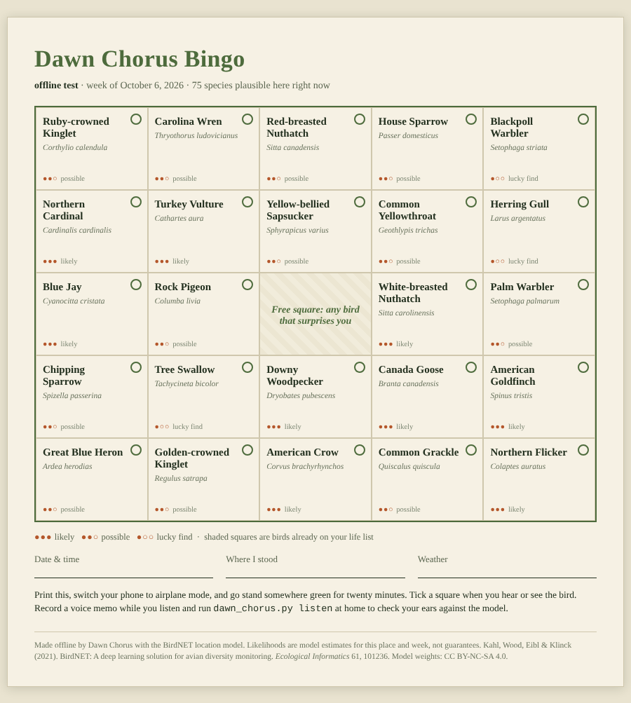

# Dawn Chorus – Open Source Birdsong & Audio Analyzer

An offline bird-call identifier that exists to get you **off the screen**. 

You print a bingo card of the birds likely where you are *this week*, go stand outside with
your phone in your pocket, record a few minutes of what you hear, and check your ears against
the model when you get home. Identification, the location model, and your life list all run
on your own machine. No account, no API key, no cloud.

The optional extras, a local **Gemma** model that acts as your walk **companion** and writes a short
field-journal entry, talk only to [Ollama](https://ollama.com) on your own computer.



## Contents

1. [Overview and the problem it solves](#overview-and-the-problem-it-solves)
2. [Tech stack](#tech-stack)
3. [Windows quick start](#windows-quick-start-no-terminal-knowledge-needed)
4. [Setup](#setup)
5. [Running it](#running-it)
6. [Optional: a local Gemma writes your field journal](#optional-a-local-gemma-writes-your-field-journal)
7. [Testing](#testing)
8. [Directory structure](#directory-structure)
9. [Honest limits](#honest-limits)
10. [License](#license)

## Overview and the problem it solves

Most AI apps are built to keep you looking at a screen. Bird-ID apps are a good example: you
walk a trail with the phone held up, watching a spectrogram instead of the bird.

Dawn Chorus uses the same kind of model to do the opposite. It *bookends* a walk and then
gets out of the way:

| Step | Command | What happens |
|---|---|---|
| Before you go | `plan` | Asks the BirdNET **location model** which species are plausible at your latitude/longitude in this week of the year, then draws 24 of them for a printable 5x5 bingo card. Birds you haven't heard yet are favoured, and likelier birds are drawn more often. |
| On the walk | (nothing) | Take the paper card outside, listen, look, tick squares with a pencil. Optionally leave a voice memo running. |
| Before you go (optional) | `companion` | A short chat with a local Gemma that has read this week's bingo card and your life list. It suggests a walk mission, answers a few questions, and then tells you to put the phone away. |
| Back home | `listen` | Decodes your recording, slides a 3-second window across it, runs the **audio classifier**, keeps birds that clear a confidence threshold **and** make sense for your place and week, writes illustrated field notes, and adds new species to your life list. |

There are two privacy reasons to keep all of this local. A trail recording can contain
conversations, children's voices, and clues about where you are and when. And birding often
happens where there is no signal, which is exactly when a cloud-only identifier fails.

The `plan` card is deterministic: it is seeded by place + week + the size of your life list,
so re-running it gives the same card until the week turns over (migrants move through) or you
add a new species.

## Tech stack

| Piece | What it is | Role |
|---|---|---|
| **Python 3.10+** | | The whole tool is one file, `dawn_chorus.py` (about 800 lines). |
| **[BirdNET V2.4](https://github.com/kahst/BirdNET-Analyzer)** | Open-weight bird-sound classifier and location ("meta") model | Does **all** the identifying and the geographic filtering. |
| **[LiteRT / TFLite](https://pypi.org/project/ai-edge-litert/)** (`ai-edge-litert`) | Google's open-source on-device inference runtime | Runs the BirdNET models on the CPU. |
| **numpy** | | Windowing, sigmoid, sorting. |
| **ffmpeg** | | Decodes mp3, m4a, wav, ogg and anything else to 48 kHz mono. |
| **SQLite** (`sqlite3`, standard library) | | Your life list, in `~/.dawn_chorus/life_list.db`. |
| **[Ollama](https://ollama.com) + [Gemma](https://ai.google.dev/gemma)** | Local LLM server and Google's open-weight model | *Optional.* The walk companion (`companion`) and the journal paragraph (`listen --journal`). It never hears audio; it only sees text facts that BirdNET and the bingo card already produced. |
| **`urllib` (standard library)** | | The Ollama client. No `requests` dependency. |
| **`unittest` + `unittest.mock`** | | The test suite. |
| **Bash** | | Preflight and offline-proof scripts in `scripts/`. |

Things this project deliberately does **not** use: Librosa, TensorFlow, `requests`, or any
hosted API. Audio is decoded by ffmpeg and the models run on LiteRT, which keeps the install
small (three pip packages). Ollama and Gemma never listen to audio; they only see short
text lists (the bingo card, the species BirdNET found).

## Windows quick start (no terminal knowledge needed)

Install [Python](https://www.python.org/downloads/) (tick **Add python.exe to PATH**) and, optionally,
[Ollama](https://ollama.com). Then unzip the project and double-click the files in the `windows` folder,
in order:

| File | What it does | Needs internet? |
|---|---|---|
| `1_setup.bat` | Installs numpy, ai-edge-litert and birdnetlib (about 170 MB), then checks the AI runtime really loads. If it does not, it prints the actual reason and the usual fixes. | yes |
| `2_check.bat` | Runs `python dawn_chorus.py doctor`: do the BirdNET models load? | no |
| `3_plan.bat` | Asks for your latitude/longitude and opens this week's bingo card. | no |
| `4_demo.bat` | Downloads the BirdNET example recording and identifies the birds in it. Needs ffmpeg: `winget install Gyan.FFmpeg`, then reopen your terminal. | first run |
| `5_gemma.bat` | Same demo, plus a journal paragraph from a Gemma model in Ollama. Finds the Gemma model you have installed. | no |
| `6_run_tests.bat` | Runs all the automated tests. | no |
| `7_companion.bat` | Chat with the Gemma walk companion (needs Ollama and a Gemma model). | no |

Or type the commands yourself (use `python`, not `python3`, on Windows):

```powershell
python -m pip install numpy ai-edge-litert
python -m pip install --no-deps birdnetlib
python dawn_chorus.py doctor
python dawn_chorus.py plan --lat 42.45 --lon -76.50 --place "My walk"
```

**Windows status, honestly:** the Python code was written and tested on Linux. Reading it for
Windows problems turned up one real bug (`strftime("%-d")` is rejected by Windows, which would have
crashed `plan` and `listen`), now fixed and covered by tests that simulate it on any platform. The `.bat`
files and the Windows run itself have **not** been run on a real Windows machine by the author.
`scripts/*.sh` are for Linux/macOS (Git Bash or WSL on Windows); `scripts/offline_check.sh` needs Linux.

## Setup

### 1. The core tool (needed)

```bash
pip install numpy ai-edge-litert
pip install --no-deps birdnetlib      # its wheel carries the BirdNET weights (~66 MB)
```

`birdnetlib` is installed with `--no-deps` on purpose and is never imported by Dawn Chorus.
The tool only reads the model files out of the installed package, which avoids pulling in
Librosa and its large dependency tree.

Install ffmpeg:

```bash
sudo apt install ffmpeg        # Debian/Ubuntu
brew install ffmpeg            # macOS
winget install Gyan.FFmpeg     # Windows (or download from https://ffmpeg.org)
```

On Windows, use `python` where this README says `python3`. Wheels for numpy and
`ai-edge-litert` exist for Python 3.10 to 3.13, but Windows has not been tested by the author
(see [Honest limits](#honest-limits)).

Check that everything loads:

```bash
python3 dawn_chorus.py doctor
```

### 2. Ollama and Gemma (optional, only for `--journal`)

1. Install Ollama from <https://ollama.com>.
2. Start the server. The desktop app does this for you; otherwise run this in a terminal and
   leave it open:

   ```bash
   ollama serve
   ```

3. Download a Gemma model. This is a one-time download of roughly a gigabyte or more, so use
   a connection you are happy to spend data on:

   ```bash
   ollama pull gemma3:1b
   ```

   `gemma3:1b` is the smallest and the one used in the examples here. Model names change
   over time; browse <https://ollama.com/library> for the current Gemma tags, and use
   `ollama list` to see what you have installed. A bare `ollama pull gemma` may not exist
   under that name any more, so prefer an explicit tag.

4. Check the setup in one go:

   ```bash
   bash scripts/check_ollama.sh
   ```

   It tells you whether Ollama is reachable at `http://localhost:11434`, whether a Gemma
   model is installed, and what to type if something is missing. On Windows, run it in Git
   Bash or WSL, or just use `ollama list`.

## Running it

```bash
# 1. Before you go: a printable card for this week, where you'll be
python3 dawn_chorus.py plan --lat 42.45 --lon -76.50 --place "Cayuga Lake trail"
#    -> bingo.html   (print it, or "Save as PDF")

# 2. After you get back: drop in the voice memo from your walk
python3 dawn_chorus.py listen walk.m4a --lat 42.45 --lon -76.50 --place "Cayuga Lake trail"
#    -> walk.notes.html, and new species are added to your life list

python3 dawn_chorus.py life           # everything you've ever heard
python3 dawn_chorus.py doctor         # models load? any network modules imported?
```

No recording of your own yet? `sh scripts/get_example_audio.sh` fetches the two-minute
official BirdNET example soundscape into `examples/soundscape.wav`.

Useful flags: `--min-conf 0.3` (catch more, with more mistakes), `--out PATH`,
`--models DIR` or `$DAWN_CHORUS_MODELS`, and `$DAWN_CHORUS_DB` to move the life list.

### What you get

* **Location filtering** drops species that cannot be where you are. On the example
  recording, the same audio yields `Hawfinch` and `Chestnut-winged Cuckoo` as low-confidence
  guesses with no location, and neither survives a New York location filter.
* **Non-bird classes are excluded.** BirdNET has 7 non-species labels (Engine, Dog, Siren,
  Gun, Fireworks, Noise, Environmental). Left alone, "Engine" is reported as a new species
  and saved to your life list. A test guards this.
* **Everything is a plain file.** Cards and notes are single self-contained HTML files with
  no JavaScript, fonts, or network requests. The life list is SQLite.

## Optional: a local Gemma writes your field journal

Add `--journal` to `listen`:

```bash
python3 dawn_chorus.py listen walk.m4a --lat 42.45 --lon -76.50 --journal
python3 dawn_chorus.py listen walk.m4a --lat 42.45 --lon -76.50 --journal --ollama-model gemma3:1b
```

The `ollama_journal` function sends the detections to your local Ollama server and puts the
reply at the top of the field notes.

* **Gemma first.** With no `--ollama-model`, the tool asks Ollama which models are installed
  (`GET /api/tags`) and prefers one whose name contains `gemma` (case-insensitive). If none
  is installed it falls back to the first model listed, and if you name a model yourself,
  that choice always wins.
* **How it calls Ollama.** `POST /api/generate` with `stream: false`, temperature 0.4 and a
  short output limit, at `http://127.0.0.1:11434`. Local addresses bypass any system proxy.
  If you point `--ollama-host` at another computer, the tool prints a notice that your
  detections will be sent there.
* **The prompt is fenced in.** It contains only the species list, place and date, and tells
  the model to use only those facts and not to invent behaviour. A language model can still
  be wrong, so the page labels the paragraph as AI-written. The detection list is the record.
* **It fails soft.** If Ollama isn't running, the model isn't installed, the request times
  out, or the reply is empty or garbled, the notes are still written and the tool prints
  `journal skipped: ...` with a hint (such as `ollama pull <model>`).
* **Model names ending in `-cloud`** usually run on Ollama's servers rather than on your
  computer. For a fully local run, pick a Gemma tag without `-cloud`.

## Optional: a Gemma companion for the walk

`companion` is a short chat, before you go out, with a Gemma model running in Ollama on your own computer:

```bash
python3 dawn_chorus.py companion --lat 42.45 --lon -76.50 --place "Cayuga Lake trail"
python3 dawn_chorus.py companion --lat 42.45 --lon -76.50 --once        # just print the walk mission
python3 dawn_chorus.py companion --lat 13.08 --lon 80.27 --language Tamil   # ask for another language
```

It opens by suggesting a walk mission built from **this week's bingo card**, then answers up to
`--turns` of your messages (default 4, maximum 10). Press Enter or type `go` when you are ready, and it ends
by telling you to put the phone away, and what to run when you are back.

Design choices, because a chatbot that keeps you at the screen would defeat the point:

* **Short on purpose.** Replies are limited to about 3 sentences, the number of turns is capped, and
  the program (not the model) prints the closing "time to go outside" message.
* **Grounded in facts we really have.** The system prompt contains today's date and week, your place,
  the 24 birds on the card with how likely each is this week (from the BirdNET location model), and
  your life-list count and latest additions. The model is told it may mention **only** those birds and
  **not** describe their songs, looks or habitat, because a small model can be confidently wrong about
  birds. General outdoor tips (stand still and listen for five minutes, look along tree edges) are allowed.
* **Local only.** It uses Ollama's `POST /api/chat` on `127.0.0.1`. With no `--ollama-model` it prefers a
  Gemma model, like the journal does. If Ollama isn't running you get a friendly message that points to
  `plan`, which needs no AI model at all.
* **Language.** `--language Tamil` (or any language name) is added to the instructions. Gemma lists many
  languages, but how good a small model is in Tamil has not been tested here.

**Testing status, honestly:** the client, the prompt, and the conversation loop (turn cap, quitting,
losing the connection mid-chat) are covered by automated tests against mocks and a stand-in server.
That does not show how helpful a real Gemma is. That needs someone to run it with a real model.

## Testing

```bash
python3 -m unittest discover -s tests -v          # 72 tests
bash scripts/check_ollama.sh                      # is a real Gemma ready? (needs Ollama)
sh scripts/offline_check.sh                       # whole pipeline with no network (Linux)
```

### Unit tests: two ways of faking Ollama, no live server needed

You do not need Ollama, a GPU, or a model download to run the test suite. There are two
complementary approaches, in two files:

| File | Tests | How Ollama is replaced |
|---|---|---|
| `tests/test_dawn_chorus.py` | 26 | A **stand-in HTTP server** (`FakeOllama`) started on a free local port. It speaks the real `/api/tags` and `/api/generate` protocol, so the client's actual `urllib` code, headers and JSON parsing are exercised end to end. The file also covers BirdNET geography, real-audio identification, bingo, the life list, and Windows portability (date formats and console encoding, simulated on any platform). |
| `tests/test_ollama_mock.py` | 24 | **`unittest.mock`**: `urllib.request.build_opener` is patched with a mock opener. A guard patches `socket.socket.connect` to raise, so any accidental real network call fails the test. |
| `tests/test_companion.py` | 22 | The Gemma companion: the `/api/chat` client (mocked), the grounded system prompt, the conversation loop with scripted inputs (turn cap, quitting, losing Ollama mid-chat), and the `companion` command end to end against the stand-in server. |

What the mock tests check:

* **Success path:** the request is a `POST` to `/api/generate` with the right model,
  `stream: false`, and a prompt that lists the detected birds; the reply is stripped.
* **Gemma priority:** Gemma beats models listed before it, matching ignores case, the first
  Gemma wins when several exist, a model-less install falls back to the first model, and an
  explicit `--ollama-model` skips the lookup entirely.
* **Failure modes:** connection refused, timeout, unknown model (404, with an
  `ollama pull` hint), server error (500, no pull hint), no models installed, empty answer,
  missing `response` field, and a garbled body all become a friendly `OllamaError`.
* **Staying local:** local hosts bypass proxies, remote hosts are flagged, and networking
  modules are not even imported until `--journal` is used.
* **Prompt safety:** only detected birds appear in the prompt, and model output is
  HTML-escaped on the notes page.

These assertions were mutation-checked: deliberately breaking the Gemma preference, the
fallback model, or the `stream: false` setting each makes tests fail.

### Using it in CI

Because nothing needs a network or a model server, the suite can run on any CI runner with
Python and the three pip packages:

```yaml
# .github/workflows/test.yml
name: tests
on: [push, pull_request]
jobs:
  test:
    runs-on: ubuntu-latest
    steps:
      - uses: actions/checkout@v4
      - uses: actions/setup-python@v5
        with: { python-version: "3.12" }
      - run: sudo apt-get install -y ffmpeg
      - run: pip install numpy ai-edge-litert && pip install --no-deps birdnetlib
      - run: python -W error::ResourceWarning -m unittest discover -s tests -v
```

(This workflow is a suggested starting point, not a file in this repository, and it has not
been run on GitHub Actions.)

### What the tests do **not** prove

They prove that the client code builds the right request and handles Ollama's replies and
failures correctly. They say nothing about the quality of text a **real** Gemma model
writes. The author's build sandbox could not reach Ollama or Hugging Face, so a run against
a real local Gemma still has to be done on a machine that has one. Use
`scripts/check_ollama.sh` and then `listen --journal` to do it.

### The scripts

* **`scripts/check_ollama.sh`** checks `http://localhost:11434` (override with
  `DAWN_CHORUS_OLLAMA_URL`), lists installed models, finds a Gemma one, warns about `-cloud`
  names, and prints a ready-to-run command. Exit codes: `0` ready, `1` Ollama not reachable,
  `2` no Gemma installed, `3` curl missing.
* **`scripts/offline_check.sh`** runs `plan` and `listen` inside a Linux network namespace
  whose only interface is loopback, so anything that tried to phone home would fail. It
  needs `unshare` and permission to create namespaces.

### Measured, and not yet measured

Measured on a 2-vCPU cloud sandbox with no GPU: 120 s of audio identified in about 1.5 s,
models load in under 0.1 s, and a clean-venv install pulls in three packages. That is one
machine, so treat the numbers as an example.

## Directory structure

```
dawn-chorus/
├── dawn_chorus.py                the whole tool (~800 lines: BirdNET + LiteRT + numpy)
├── requirements.txt              numpy, ai-edge-litert (+ birdnetlib --no-deps, see Setup)
├── LICENSE                       MIT, for the code only
├── README.md
├── windows/                      double-click helpers: 1_setup ... 7_companion (.bat)
├── scripts/
│   ├── check_ollama.sh           is Ollama up and is a Gemma model installed?
│   ├── offline_check.sh          run everything with no network (Linux)
│   └── get_example_audio.sh      fetch the BirdNET example soundscape
├── tests/
│   ├── test_dawn_chorus.py       26 tests: geography, real audio, stand-in Ollama server, Windows portability
│   ├── test_ollama_mock.py       24 tests: unittest.mock, no sockets allowed
│   └── test_companion.py         22 tests: the Gemma walk companion
└── samples/                      a generated bingo card and field notes (html + png)
```

## Honest limits

* BirdNET misidentifies birds. Treat life-list entries as "the model heard it", and confirm
  anything you care about by ear or eye. The 0.5 default is deliberately conservative.
* The bingo card is only as good as the location model's estimate of your area and week.
  Coverage is better where there is a lot of eBird-style data.
* **Not yet tested:** a phone recording from a real walk, a real Gemma model, Raspberry Pi,
  Windows, or macOS. Only the official example soundscape was used for audio testing.
  If you try those, please open an issue.
* Swapping models: all model paths come from `find_models()`. Point `--models` (or
  `$DAWN_CHORUS_MODELS`) at a folder holding another BirdNET-compatible export, for example
  one you fine-tuned on your local birds. If its labels file matches the model output
  length, nothing else changes.

## License

* **Code:** [MIT](LICENSE) © the Dawn Chorus authors. Use it, change it, share it.
* **BirdNET model weights:** **CC BY-NC-SA 4.0**. They are open and free to use, modify and
  share with attribution, but **not for commercial use**. The weights are not part of this
  repository's MIT license; they arrive with the `birdnetlib` package. Check BirdNET's license
  before building anything commercial on this.
* **Gemma** is used under Google's Gemma terms, and is only downloaded by you through
  Ollama.

Cite BirdNET as: Kahl, Wood, Eibl & Klinck (2021), *BirdNET: A deep learning solution for
avian diversity monitoring*, Ecological Informatics 61, 101236.
